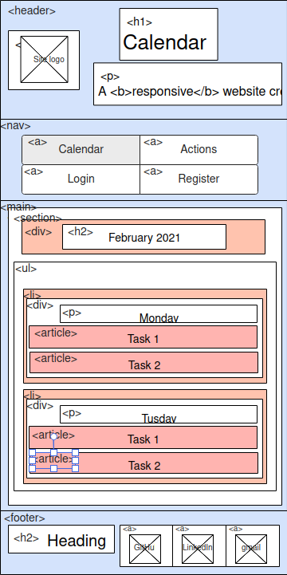

# Calendar application
## Description

Time-, task- and activity-management application. User can set appointments, tasks for every day.

## Functionality

- Authentication
- Calendar view. Days with appointments should be marked by colour of appointment (or multiple colours in case of more than one appointment).
- Day actions view.
- Upcoming appointment for current day / pending tasks are on top of the page.
- Appointment creation
    - title
    - description
    - start / end date and time
    - place (may be empty)
    - zero, one or more reminders (user can type in when to remind)
    - colour (to distinguish tasks)
- Task creation (tasks have a 'completed' status. After user marked task as 'completed', it will disappear from 'pending' section)
- Ability to edit / delete appointment or task
- Admin panel
- Dark theme

Remark: _The following representations are as close as possible, but not absolutely accurate. In order not to clutter the views, tag types were not specified everywhere._
## Views

### Calendar view / main page

### Day actions/tasks view 

### Login view

### Register view

### Admin panel view

### Error page

